<!--
  Profile README for github.com/ayush-jena-721
  Every panel is a hand-built SVG in ./assets (dark + light), generated by
  tools/build.py. <picture> picks the version matching the viewer's GitHub
  theme. Metrics on the project cards are the numbers published in each
  repository's own README; the contribution matrix is rebuilt daily from
  the GitHub API by .github/workflows/profile-sync.yml.
-->

<picture>
  <source media="(prefers-color-scheme: dark)" srcset="assets/header-dark.svg">
  <source media="(prefers-color-scheme: light)" srcset="assets/header-light.svg">
  
</picture>

> **J.A.R.V.I.S.** ▸ *Good evening. I've prepared Ayush's engineering profile for you. Every module below is live; the numbers are his, the narration is mine.*

### About me

I'm a developer working where **Python, machine learning, computer vision and IoT** overlap. I build things end to end: a CNN and the script that trains it, a desktop app and the database behind it, an ESP32 node and the dashboard that reads from it. Some of what's here is a finished application; some is a prototype that exists purely because I wanted to understand how something works. Both are on purpose.

<table>
<tr>
<td width="50%" valign="top">

<picture>
  <source media="(prefers-color-scheme: dark)" srcset="assets/holo-dark.svg">
  <source media="(prefers-color-scheme: light)" srcset="assets/holo-light.svg">
  
</picture>

</td>
<td width="50%" valign="top">

<picture>
  <source media="(prefers-color-scheme: dark)" srcset="assets/terminal-dark.svg">
  <source media="(prefers-color-scheme: light)" srcset="assets/terminal-light.svg">
  
</picture>

</td>
</tr>
</table>

- 🧠 Currently deepening my work in **deep learning and computer vision**
- 🔧 Comfortable moving between **software and hardware**
- 📍 Based in **India**
- 💬 Ask me about OpenCV, Keras, ESP32, or why the confusion matrix looks like that

### Capabilities

<picture>
  <source media="(prefers-color-scheme: dark)" srcset="assets/skills-dark.svg">
  <source media="(prefers-color-scheme: light)" srcset="assets/skills-light.svg">
  
</picture>

### Project files

Each repository includes a training script, saved metrics, plots and a predictor you can run in a minute.

<a href="https://github.com/ayush-jena-721/handwritten-digit-recognizer">
<picture>
  <source media="(prefers-color-scheme: dark)" srcset="assets/project-digits-dark.svg">
  <source media="(prefers-color-scheme: light)" srcset="assets/project-digits-light.svg">
  
</picture>
</a>

<a href="https://github.com/ayush-jena-721/spam-email-classifier">
<picture>
  <source media="(prefers-color-scheme: dark)" srcset="assets/project-spam-dark.svg">
  <source media="(prefers-color-scheme: light)" srcset="assets/project-spam-light.svg">
  
</picture>
</a>

<a href="https://github.com/ayush-jena-721/fruit-image-classifier">
<picture>
  <source media="(prefers-color-scheme: dark)" srcset="assets/project-fruit-dark.svg">
  <source media="(prefers-color-scheme: light)" srcset="assets/project-fruit-light.svg">
  
</picture>
</a>

<a href="https://github.com/ayush-jena-721/speech-to-text-transcription">
<picture>
  <source media="(prefers-color-scheme: dark)" srcset="assets/project-speech-dark.svg">
  <source media="(prefers-color-scheme: light)" srcset="assets/project-speech-light.svg">
  
</picture>
</a>

<a href="https://github.com/ayush-jena-721/twitter-sentiment-analysis">
<picture>
  <source media="(prefers-color-scheme: dark)" srcset="assets/project-sentiment-dark.svg">
  <source media="(prefers-color-scheme: light)" srcset="assets/project-sentiment-light.svg">
  
</picture>
</a>

<a href="https://github.com/ayush-jena-721?tab=repositories">
<picture>
  <source media="(prefers-color-scheme: dark)" srcset="assets/project-more-dark.svg">
  <source media="(prefers-color-scheme: light)" srcset="assets/project-more-light.svg">
  
</picture>
</a>

### Workshop

The hardware side, as a hologram: the ESP32 field node from the Agro Management System, exploded into its parts and assembling itself on loop.

<picture>
  <source media="(prefers-color-scheme: dark)" srcset="assets/assembly-dark.svg">
  <source media="(prefers-color-scheme: light)" srcset="assets/assembly-light.svg">
  
</picture>

### Additional systems

<picture>
  <source media="(prefers-color-scheme: dark)" srcset="assets/otherwork-dark.svg">
  <source media="(prefers-color-scheme: light)" srcset="assets/otherwork-light.svg">
  
</picture>

### Protocol

<picture>
  <source media="(prefers-color-scheme: dark)" srcset="assets/workflow-dark.svg">
  <source media="(prefers-color-scheme: light)" srcset="assets/workflow-light.svg">
  
</picture>

### Activity

<picture>
  <source media="(prefers-color-scheme: dark)" srcset="assets/matrix-dark.svg">
  <source media="(prefers-color-scheme: light)" srcset="assets/matrix-light.svg">
  
</picture>

<table>
<tr>
<td width="50%">

<picture>
  <source media="(prefers-color-scheme: dark)" srcset="https://github-readme-stats.vercel.app/api?username=ayush-jena-721&show_icons=true&hide_border=true&bg_color=0d1117&title_color=f5c451&icon_color=ff4d4d&text_color=e6edf3&hide_title=true&rank_icon=github">
  
</picture>

</td>
<td width="50%">

<picture>
  <source media="(prefers-color-scheme: dark)" srcset="https://streak-stats.demolab.com?user=ayush-jena-721&hide_border=true&background=0d1117&ring=f5c451&fire=ff4d4d&currStreakLabel=f5c451&sideLabels=e6edf3&currStreakNum=e6edf3&sideNums=e6edf3&dates=8b949e">
  
</picture>

</td>
</tr>
<tr>
<td width="50%">

<picture>
  <source media="(prefers-color-scheme: dark)" srcset="https://github-readme-stats.vercel.app/api/top-langs/?username=ayush-jena-721&layout=compact&hide_border=true&bg_color=0d1117&title_color=f5c451&text_color=e6edf3&hide_title=true">
  
</picture>

</td>
<td width="50%">

<picture>
  <source media="(prefers-color-scheme: dark)" srcset="https://github-profile-trophy.vercel.app/?username=ayush-jena-721&theme=darkhub&no-frame=true&no-bg=true&column=7&margin-w=8&margin-h=8">
  
</picture>

</td>
</tr>
</table>

<picture>
  <source media="(prefers-color-scheme: dark)" srcset="https://github-readme-activity-graph.vercel.app/graph?username=ayush-jena-721&bg_color=0d1117&color=e6edf3&line=f5c451&point=ff4d4d&area=true&area_color=f5c451&hide_border=true&custom_title=Contribution%20activity%20%C2%B7%20last%2031%20days">
  
</picture>

<picture>
  <source media="(prefers-color-scheme: dark)" srcset="https://raw.githubusercontent.com/ayush-jena-721/ayush-jena-721/output/github-snake-dark.svg">
  <source media="(prefers-color-scheme: light)" srcset="https://raw.githubusercontent.com/ayush-jena-721/ayush-jena-721/output/github-snake.svg">
  
</picture>

### Open a channel

<picture>
  <source media="(prefers-color-scheme: dark)" srcset="assets/footer-dark.svg">
  <source media="(prefers-color-scheme: light)" srcset="assets/footer-light.svg">
  
</picture>

  
  
  

J.A.R.V.I.S. is a design conceit, not a bot — every panel is a hand-built SVG animated with CSS/SMIL — no JavaScript, no third-party card services except the stat cards above. The contribution matrix and the snake are rebuilt daily by GitHub Actions from real account data. Regenerate everything with <code>python tools/build.py</code>.
